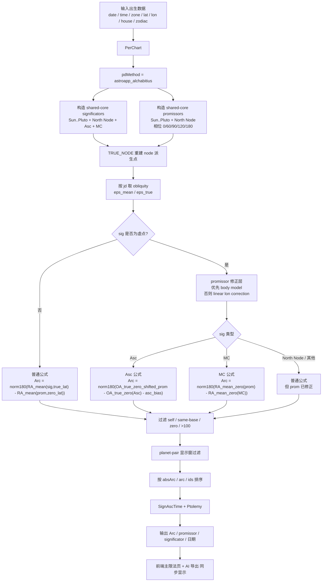

# AstroAPP-Alchabitius 主限法数学版与流程图

这份文档描述 Horosa 当前生产版 `AstroAPP-Alchabitius` 的数学骨架，以及它在工程里额外叠加的修正层。

工程落地说明见：

- `PRIMARY_DIRECTION_ASTROAPP_ALCHABITIUS_REPLICATION.md`

## 1. 这不是“纯公式版”，而是“公式 + 修正层”

当前本地实现要逼近 AstroApp，实际由两部分组成：

1. 主限法数学骨架
2. 为逼近 AstroApp 当前网站输出而加上的工程修正

如果只保留第 1 部分，无法达到当前生产精度。

## 2. 符号

设：

- 黄经：`lambda`
- 黄纬：`beta`
- 地理纬度：`phi`
- 日期对应的 mean obliquity：`eps_mean`
- 日期对应的 true obliquity：`eps_true`

定义：

```text
Eq_mean(lambda, beta) -> (RA_mean, decl_mean)
Eq_true(lambda, beta) -> (RA_true, decl_true)
```

当前实现等价于：

```text
Eq_*(lambda, beta) = swisseph.cotrans([lambda, beta, 1], -eps_*)
```

## 3. 对象集

当前 shared-core：

```text
CORE = {
  Sun, Moon, Mercury, Venus, Mars, Jupiter, Saturn,
  Uranus, Neptune, Pluto, North Node
}
```

Promissor：

```text
PROM = N(CORE, {0,60,90,120,180})
```

Significator：

```text
SIG = N(CORE, {0}) union {Asc, MC}
```

明确排除：

```text
Terms / Bounds / Pars Fortuna / Dark Moon / Purple Clouds / South Node / extra virtual points
```

## 4. 相位化对象

对本体 `X(lambda, beta)`：

### 4.1 合相 / 对冲

```text
N(X, a):
  lambda' = lambda + a
  beta'   = beta
```

其中 `a in {0,180}`。

### 4.2 Dexter

```text
D(X, a):
  lambda' = lambda - a
  beta'   = beta
```

### 4.3 Sinister

```text
S(X, a):
  lambda' = lambda + a
  beta'   = beta
```

## 5. True Node 重建

AstroApp 当前口径：

```text
moon_node_id = T
```

因此北交点本体必须取：

```text
NorthNode = TRUE_NODE(jd)
SouthNode = NorthNode + 180°
```

然后再对 node 派生点做 `N / D / S`。

## 6. zero-lat 概念

对任意对象 `P(lambda, beta)`：

```text
Eq_mean_zero(P) = Eq_mean(lambda, 0)
Eq_true_zero(P) = Eq_true(lambda, 0)
```

即：

- 保留相位化后的黄经
- 黄纬强制归零

## 7. Oblique Ascension

定义：

```text
OA(RA, decl, phi) = RA - ascdiff(decl, phi)
```

当前 `Asc` 分支使用：

```text
OA_true_zero(P) = OA(RA_true_zero(P), decl_true_zero(P), phi)
```

## 8. 数学骨架：3 条主公式

统一归一化：

```text
norm180(x) = ((x + 180) mod 360) - 180
```

### 8.1 普通 significator

对 `sig not in {Asc, MC}`：

```text
Arc = norm180(
  RA_mean(sig, true_lat)
  -
  RA_mean(prom_aspected, zero_lat)
)
```

### 8.2 Asc

对 `sig = Asc`：

```text
Arc = norm180(
  OA_true_zero_shifted_prom(prom_aspected)
  -
  OA_true_zero(Asc)
  -
  asc_case_correction
)
```

### 8.3 MC

对 `sig = MC`：

```text
Arc = norm180(
  RA_mean(prom_aspected, zero_lat)
  -
  RA_mean(MC, zero_lat)
)
```

## 9. 工程修正层

这是当前生产实现真正贴近 AstroApp 的关键。

### 9.1 每日动态黄赤交角

```text
eps_true = swisseph.calc_ut(jd, ECL_NUT)[0][0]
eps_mean = swisseph.calc_ut(jd, ECL_NUT)[0][1]
```

用途：

- 普通对象与 `MC`：`eps_mean`
- `Asc`：`eps_true`

### 9.2 Asc promissor-side obliquity shift

```text
eps_true_prom = eps_true - 0.0014°
```

所以：

```text
OA_true_zero_shifted_prom(P)
= OA computed with eps_true - 0.0014°
```

### 9.3 虚点行 promissor body correction

当：

```text
sig in {Asc, MC, North Node}
```

时，对 promissor 本体优先施加对象级模型修正：

```text
prom_model_lon = local_lon + delta_lon_model(jd, local_body_features)
prom_model_lat = local_lat + delta_lat_model(jd, local_body_features)
```

当前覆盖：

```text
Sun .. Pluto
```

模型特征：

```text
jd_offset, lon, lon_sin, lon_cos, lat, distance, speed_lon, speed_lat
```

### 9.4 线性黄经 fallback

如果该 promissor 没有 body model，则退回：

```text
dlon = a + b * (jd - 2460500.0)
```

然后：

```text
prom_lon_corrected = local_lon + dlon
```

这层当前覆盖：

```text
Sun .. Pluto + North Node
```

### 9.5 Asc chart-level correction 仅作 fallback

仍保留：

```text
asc_case_correction = model(chart_features)
```

但当前生产逻辑是：

```text
if any(virtual_body_models_exist):
    asc_case_correction = 0
else:
    asc_case_correction = model(chart_features)
```

因此现在它不是主要修正层，而是 body models 缺失时的兜底层。

## 10. 当前生产伪代码

```text
build significators from CORE + {Asc, MC}
build promissors from CORE x aspects

rebuild node-derived points from TRUE_NODE

eps_mean = mean obliquity(jd)
eps_true = true obliquity(jd)
eps_true_prom_asc = eps_true - 0.0014°

for each prom in promissors:
  for each sig in significators:
    skip self / same-base

    prom_arc = prom
    if sig in {Asc, MC, North Node}:
      if body_model_exists(base(prom)):
        prom_arc = apply_body_model(prom)
      else:
        prom_arc = apply_linear_lon_correction(prom)

    if sig == Asc:
      arc = norm180(
        OA(prom_arc, eps_true_prom_asc, zero_lat=True)
        - OA(Asc, eps_true, zero_lat=True)
        - asc_case_correction
      )
    elif sig == MC:
      arc = norm180(
        RA(prom_arc, eps_mean, zero_lat=True)
        - RA(MC, eps_mean, zero_lat=True)
      )
    else:
      arc = norm180(
        RA(sig, eps_mean, true_lat=True)
        - RA(prom_arc, eps_mean, zero_lat=True)
      )

    skip |arc| <= eps
    skip |arc| > 100

    if prom/sig is ordinary planet pair:
      apply display window(raw zodiacal delta, arc sign)

    keep [arc, prom_id, sig_id, 'Z']

sort by (abs(arc), arc, prom_id, sig_id)
convert arc to date with Ptolemy / SignAscTime
```

## 11. 过滤与显示窗

保留一行需要满足：

```text
prom.id != sig.id
base(prom) != base(sig)
abs(Arc) > eps
abs(Arc) <= 100
```

普通 planet-to-planet 行再叠加：

```text
raw_delta = sig.lon - prom.lon
display_eps = 3.0
display_window = 107.5
```

不是所有 arc 都无条件显示。

## 12. direct / converse

不额外分两次算法。

只看 `Arc` 的符号：

```text
Arc > 0 -> direct
Arc < 0 -> converse
```

## 13. Ptolemy 日期换算

当前日期层仍然是：

```text
SignAscTime.getDateFromPDArc(arc)
```

关键输入口径是：

```text
utc_sourcejd_exact
```

即：

- 直接使用 AstroApp `sourceJD`
- 还原精确 UTC 浮点小时
- 不做字符串时间截断

## 14. 当前生产版为何能接近 AstroApp

因为它不是单层公式，而是下面这些层叠加：

1. `shared-core` 对象集限制
2. `TRUE_NODE` 重建
3. 动态 `mean / true obliquity`
4. `Asc` 的 zero-lat OA 双边公式
5. `Asc` promissor-side `-0.0014°` 微调
6. 虚点行 promissor body correction models
7. promissor longitude fallback correction
8. AstroApp 显示窗过滤
9. AstroApp 风格排序
10. `Ptolemy + SignAscTime` 日期换算

去掉其中任一层，本地结果就会偏离当前生产精度。

## 15. 当前验证结果

### 15.1 稳定集

文件：

- `runtime/pd_reverse/stability_production_summary.json`

结果：

```text
run200_login:
  shared_core arc_mae = 0.00022132906505383096
  Asc         arc_mae = 0.0003325791052690479
  MC          arc_mae = 0.000030617101092214876
  North Node  arc_mae = 0.00009889820385835736

geo300:
  shared_core arc_mae = 0.00022178467378535262
  Asc         arc_mae = 0.0003879264973732093
  MC          arc_mae = 0.000030600772530614015
  North Node  arc_mae = 0.00009942357381868132
```

### 15.2 当前大样本虚点专项

文件：

- `runtime/pd_reverse/virtual_only_geo_current540_fullfit_summary.json`

结果：

```text
Asc        arc_mae = 0.0009919652751037512
MC         arc_mae = 0.00041444975277272176
North Node arc_mae = 0.00011554510206301699
```

## 16. 流程图


